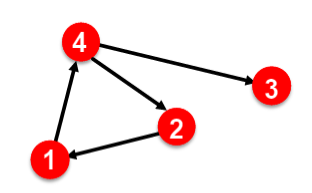
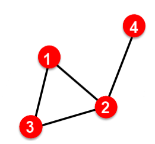
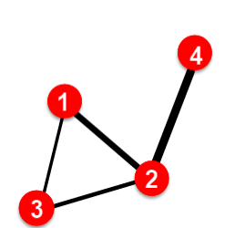
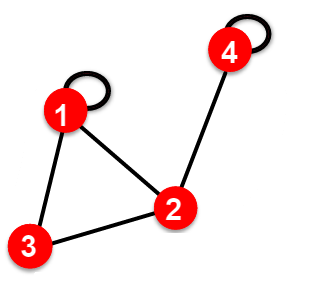
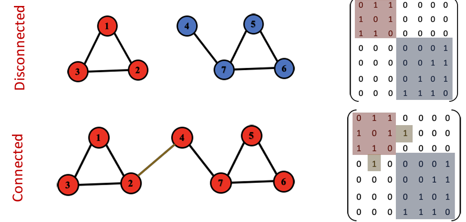
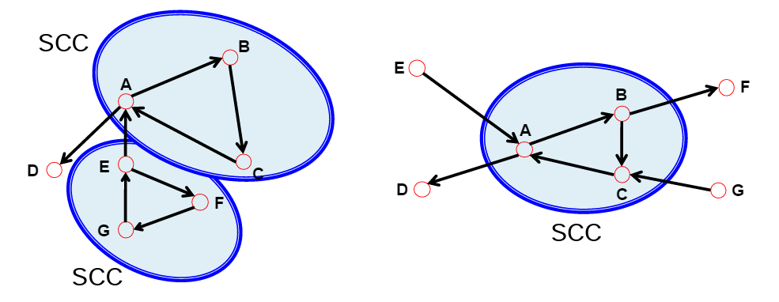
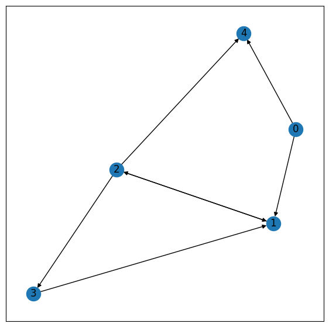
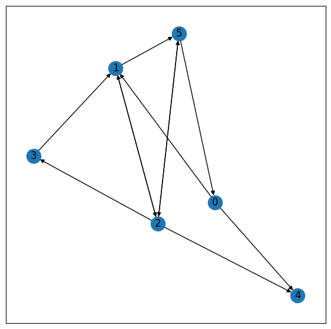

**Introduction To Geometric Deep Learning**

Devansh Chaudhary, Rudradeep Datta, Raghav Manglik, Nishtha Gupta

June 3, 2023

**1** **Introduction**

This midterm evaluation report for the project "Geomtric deep learning"
evaluates the student's progress and comprehension of Lecture 1 of
Stanford University's "ML with Graphs" course, CS224W. This report's
goal is to give a summary of the lecture's main ideas, personal
development, and opportunities for growth.

**2** **Introduction to graphs ML and their representation**

This topic introduces the concept of graphs and their representation
using nodes (vertices) and edges (links). Graphs are a fundamental data
structure used to model relationships and structures in various domains.

**2.1 Why Graphs?**

1.Show complex relationships and dependencies between entities.

> 2.Enable network analysis to understand connectivity and community
> structure. 3.Facilitate the development of graph algorithms for
> clustering and link prediction. 4.Serve as a natural representation
> for node and edge-level machine learning tasks.
>
> 5.Aid in visualizing large-scale networks, helping to extract
> meaningful insights.

**2.2 Different types of graphs:**

The lecture discusses a variety of graph types, including weighted,
unweighted, directed, and undirected graphs. Undirected graphs lack
directionally-directed edges, whereas directed graphs do. In weighted
graphs, edges are given values to indicate their strength or
significance.

**2.3 Notions of nodes, edges, and attributes in graphs:**

While edges (links) connect nodes (vertices) and represent
relationships, nodes stand in for entities or elements. Both nodes and
edges may be accompanied by features or attributes, adding more data for
analysis.

**2.4 Basics of graph visualization and network analysis:**

Graph visualization involves representing the structure and patterns of
a graph visually. It helps in exploring and understanding complex graph
data. Network analysis focuses on studying the properties and behaviors
of a network, such as identifying communities or detecting anomalies.

**2.5 Graph properties: connectivity, density, and centrality
measures:**

\- Connectivity measures determine the connectedness of a graph.
Connected components are sets of nodes that can be reached from each
other through a series of edges. Strongly connected components exist in
directed graphs, where there is a directed path between any pair of
nodes.

\- Graph density quantifies the sparsity or connectedness of a graph by
comparing the number of actual edges to the maximum possible edges.

\- Centrality measures help identify important nodes in a graph. Degree
centrality measures the number of edges connected to a node, while
betweenness centrality quantifies the extent to which a node lies on the
shortest paths between other nodes.

1

**3** **Applications Of Graphs in Real World**

Many real-world data can be naturally represented as graphs, where nodes
represent entities and links represent relationships or interactions
between entities. Examples include social networks, citation networks,
protein-protein interaction networks, and road networks. By learning
node and link-level prediction features, we can effectively capture the
underlying structure and dynamics of these graphs, enabling us to
extract valuable insights and make predictions.

**3.1 Node-level tasks and features**

Node-level prediction focuses on predicting properties or labels
associated with individual nodes in a graph. For example, in a social
network, we might be interested in predicting the occupation, age group,
or political affiliation of a user based on their interactions and
attributes. By learning node-level prediction features, we can classify
nodes into different categories or assign numerical values to them,
which can be useful for various tasks such as targeted advertising,
recommendation systems, and identifying anomalies.

**4** **Applications of Graphs in ML**

**4.1 Node-level ML Tasks: Protien folding**

Protein folding is a node-level machine learning. It needs estimating a
protein's 3D structure from its amino acid sequence. In a graph, amino
acids are nodes, and machine learning techniques, such as graph neural
networks (GNNs), learn patterns and features at the level of the
individual amino acid to forecast folding patterns. It has implications
for drug discovery and disease understanding.

**4.2 Edge-level of graph ML**

1- Recommender system\
Recommender systems are one type of edge-level machine learning problem
in ML with Graphs. They are designed to anticipate and recommend
relevant goods to users based on their preferences and previous data. In
a graph, edges reflect the connections between users and items. In order
to provide customised suggestions, edge-level machine learning
algorithms, including graph neural networks (GNNs), collect patterns and
information from user-item interactions. Applications for recommender
systems in e-commerce, content platforms, and customised marketing are
numerous.

2- Drug side effects\
Predicting and comprehending the negative effects of medications on
patients is an example of an edge-level machine learning task in ML with
Graphs. In a graph, the connections between medications and their
adverse effects are shown as edges. To find possible adverse effects,
edge-level machine learning algorithms, including graph neural networks
(GNNs), learn patterns and features from drug-side effect correlations.
These algorithms can help with drug development, enhance patient safety,
and aid in the discovery of novel drug-target interactions by analysing
the graph structure.

**4.3 Subgraph- level ML tasks: Traffic prediction**

Predicting traffic conditions and patterns at the level of subgraphs
inside a road network is an example of a subgraph-level machine learning
task in ML with Graphs. Localised regions or road segments within the
wider network are represented by subgraphs. In order to predict traffic
congestion, journey durations, or accident chances, machine learning
algorithms, such as graph neural networks (GNNs), learn patterns and
characteristics from the subgraph structure, historical traffic data,
and numerous environmental parameters. These algorithms can help with
real-time traffic management, route planning, and transportation
infrastructure optimisation by looking at subgraphs.

**5** **Representing Graphs: Adjacency Matrix**

Graphs can be represented in form of a matrix for operational and
calculative purposes. Among the simplest of these matrices, *Aij* = 1 if
there is a link between *ith*and *jth*nodes and *Aij* = 0 if no link is
present. In this matrix, *Aij* represents a link from *ith*node to
*jth*node. Order of these square matrices is same as total number of
nodes in that graph.

It is worth noting that most real world networks are sparse. This
implies most elements in adjacency matrix of graphs of these networks
are zero. It can be understood from the fact that degree of a node in
real network is way less that total number of nodes in that network.

2

**6** **Representation of Different Types of Graphs**

Based on their own characteristics and properties, Different graphs can
be represented in matrix form.

**6.1 Directed and Undirected Graphs**

As an undirected graph is a graph where the edges do not have a specific
direction associated with them, the edges represent symmetric
relationships between vertices. This means that if there is an edge
between vertex A and vertex B, there is also an edge between vertex B
and vertex A.

| 1   | 0   | 0 | 1   |
| --- | --- | --- | --- |
| 0  | 0   | 0   | 1   |
| 1   | 1 | 1   | 0   |
| 0   | 1   | 0   | 1   |

>Figure 1: Example of Undirected Graph Representation
> It can be observed that the property of symmetry in graph is extended
> to it's matrix form.

Furthermore, As directed graph (or digraph) is a graph where the edges
have a specific direction associated with them, the edges represent
asymmetric relationships between vertices. This means that if there is
an edge from vertex A to vertex B, it does not necessarily imply the
existence of an edge from vertex B to vertex A. The edges in a directed
graph have a distinct source (starting vertex) and target (ending
vertex). A similar

| 0   | 0   | 0 | 1   |
| --- | --- | --- | --- |
| 1  | 0   | 0   | 0   |
| 0   | 0 | 0   | 0   |
| 0   | 1   | 1   | 0   |
>Figure 2: Example of Directed Graph Representation
>Observation can be made about asymmetry being extended to graph's matrix form.

**6.2 Weighted and Unweighted Graphs**

In an unweighted graph, all edges have equal importance or weight. Each
edge is represented as a connection between two vertices without any
additional numerical value associated with it. Friendship and Hyperlink
can be represented with this graph.

In a weighted graph, each edge has an associated weight or value. The
edge weight represents a numerical measure of the importance, distance,
cost, or any other property associated with the connection between two
vertices. Road networks and social networks can be represented with
these graphs.

**6.3 Self-edges (Self Loops)**

A self-edge (or self-loop) is an edge that connects a vertex to itself.
It represents a connection or relationship within a single vertex. It's
matrix form is characterised by *Aij* not zero. Proteins and Hyperlinks
are represented by these graphs.

| 0   | 1   | 1 | 0   |
| --- | --- | --- | --- |
| 1  | 0   | 1   | 1   |
| 1   | 1 | 0   | 0   |
| 0   | 1   | 0   | 0   |

>Figure 3: Example of Unweighted Graph Representation

| 0   | 2   | 0.5 | 1   |
| --- | --- | --- | --- |
| 2   | 0   | 1   | 4   |
| 0   | 0.5 | 1   | 0   |
| 0   | 4   | 0   | 0   |

>Figure 4: Example of weighted Graph Representation

**6.4 Multigraphs**

A multigraph is a type of graph that allows multiple edges between pairs
of vertices. Unlike simple graphs, where only one edge can exist between
any two vertices, multigraphs permit multiple parallel edges. The
multiple edges can have different attributes, such as different weights,
colors, or meanings.

**7** **Connectivity**

**7.1 Undirected Graphs**

These are of 2 types based on connectivity, connected and disconnected.

In a Connected graph, one can always find a path to join any two of it's
vertices. Contrary to this, A disconnected graph is made up of two or
more connected components. While representing these graphs, The
adjacency matrix of a network with several components can be written in
a block-diagonal form, so that nonzero elements are confined to squares,
with all other elements being zero.

**7.2 Directed Graphs**

These are of 2 types based on connectivity, strongly-connected and
weakly-connected.

A strongly-Connected graph has a path from each node to every other node
and vice versa. A weakly-connected graph, on the other hand, is
connected if we disregard the edge directions.

In such graphs, Strongly connected components (SCCs) can also be
identified where in a particular component of the graph is strongly
connected. But it is worth noting that not every node is part of a
nontrivial strongly connected component. Through these components we can
defines In-component and Ou-component nodes. In

!
| 1   | 1   | 1 | 0   |
| --- | --- | --- | --- |
| 1   | 0   | 1   | 1   |
| 1   | 1 | 0   | 0   |
| 0   | 1   | 0   | 1   |

>Figure 5: Example of Self Looped Graph Representation

!
| 0   | 2   | 1 | 0   |
| --- | --- | --- | --- |
| 2   | 0   | 1   | 3   |
| 1   | 1 | 0   | 0   |
| 0   | 3   | 0   | 0   |

>Figure 6: Example of Multigraph Representation

component nodes are those which can reach the SCC whereas Out-component
nodes are those which can be reached from the SCC. In Example below E
and G is In-component while D and F are out component.

!

>Figure 7: Connectivity of Undirected Graphs

!

>Figure 8: Strongly Connected Components in an Directed Graph

6

 **8** **Implemenation**

 In this section, we discuss our assignment which focuses on graph
 creation using PyG.

 **8.1 Section-1: Graph Creation**

 **8.1.1** **Creating the following graph in PyG. The numbers inside
 the squares are both the ID** **and the values stored in the notes.**

!

Figure 9: Graph

> In here, we are trying to implement a specific directed graph in PyG.
> The graph consists of nodes with ID and values stored in them.

+-----------------------------------------------------------------------+
| > import torch\                                                       |
| > from torch_geometric.data import Data                               |
| >                                                                     |
| > *\# Define the edge indices*\                                       |
| > edge_index = torch.tensor(\[\[0, 0, 1, 2, 2, 2, 3\],\               |
| > \[1, 4, 2, 1, 3, 4, 1\]\], dtype=torch.long)                        |
| >                                                                     |
| > *\# Define the node features*\                                      |
| > x = torch.tensor(\[\[0\], \[1\], \[2\], \[3\], \[4\]\],             |
| > dtype=torch.float)                                                  |
| >                                                                     |
| > *\# Create the PyG Data object*\                                    |
| > data = Data(x=x, edge_index=edge_index)                             |
+=======================================================================+
+-----------------------------------------------------------------------+

> In the above code, the edge index tensor defines the edge connections
> between nodes, and the x tensor represents the node features. Finally,
> the Data object is created, encapsulating the graph structure and node
> features.
>
> **8.1.2** **Complete the code to visualise the graph using the
> utilities module of PyG**
>
> We write the code to visualize the graph using the utilities module of
> PyG to create a NetworkX Graph object. The to networkx function is
> used to convert the PyG Data object to a NetworkX Graph object. The
> resulting Graph object can be passed to the visualize graph helper
> function for visualization.
>
> The provided code snippet demonstrates how to visualize the graph
> using the visualize graph function with the NetworkX Graph object.

+-----------------------------------------------------------------------+
| > from torch_geometric.utils import to_networkx\                      |
| > import networkx as nx\                                              |
| > import matplotlib.pyplot as plt                                     |
| >                                                                     |
| > *\# Convert PyG Data object to NetworkX Graph object* G =           |
| > nx.DiGraph(to_networkx(data))                                       |
| >                                                                     |
| > *\# Helper function for visualization*\                             |
| > def visualize_graph(G):\                                            |
| > plt.figure(figsize=(7,7))\                                          |
| > plt.xticks(\[\])                                                    |
+=======================================================================+
+-----------------------------------------------------------------------+

7

+-----------------------------------------------------------------------+
| > plt.yticks(\[\])\                                                   |
| > nx.draw_networkx(G, pos=nx.spring_layout(G, seed=42),               |
| > with_labels=True, cmap=\"Set3\") plt.show()                         |
| >                                                                     |
| > *\# Visualize the graph using the visualize_graph function*         |
| > visualize_graph(G)                                                  |
+=======================================================================+
+-----------------------------------------------------------------------+

> The above code converts the PyG Data object to a NetworkX Graph object
> using the to networkx function. The resulting Graph object is then
> passed to the visualize graph function for visualization.

!

Figure 10: Output Graph

> The resulting graph, as shown in Figure 10, matches the specified
> graph in the question.
>
> **8.1.3** **Modifying existing graph**
>
> We attempt to modify the previously created graph by adding new nodes
> and edges. The modifications include adding a node with ID 5 and
> creating edges between specific nodes. The provided code snippet
> demonstrates how to make these modifications to the NetworkX Graph
> object.

+-----------------------------------------------------------------------+
| > *\# Add nodes and edges to the graph*\                              |
| > G.add_edge(1, 5)\                                                   |
| > G.add_edge(5, 0)\                                                   |
| > G.add_edge(5, 2)\                                                   |
| > G.add_edge(2, 5)                                                    |
| >                                                                     |
| > *\# Visualize the modified graph*\                                  |
| > visualize_graph(G)                                                  |
+=======================================================================+
+-----------------------------------------------------------------------+

> The above code adds a node with ID 5 and creates edges between nodes 1
> and 5, 5 and 0, and 2 and 5. These modifications update the graph
> structure accordingly. Finally, the modified graph can be visualized
> using the visualize graph function.
>
> The resulting graph, as shown in Figure 11, matches the specified
> graph in the question.
>
> **8.2 Section-2: Graph Properties and Manipulation**
>
> **8.2.1** **Basic properties of a given graph**
>
> The properties include the number of nodes, edges, node features, and
> directedness of the graph, to be returned as the tuple:\
> (#nodes, #edges, #features, directedness)\
> The function get basic chars is implemented as follows:

8

!

Figure 11: Output Graph

+-----------------------------------------------------------------------+
| > def get_basic_chars(dataset):\                                      |
| > nodes = dataset.num_nodes\                                          |
| > edges = dataset.num_edges\                                          |
| > features = dataset.num_node_features\                               |
| > directedness = dataset.is_directed()\                               |
| > chars = (nodes, edges, features, directedness) return chars         |
| >                                                                     |
| > *\# Call the function on the \'mutag\' graph*\                      |
| > get_basic_chars(mutag)                                              |
+=======================================================================+
+-----------------------------------------------------------------------+

> The get basic chars function takes a PyG Dataset object as input and
> extracts the required properties using the provided PyG functions. The
> properties are then returned as a tuple: (42, 162, 3, False). When
> called on the 'mutag' graph, the function returns the following
> output: (42, 162, 3, False). This indicates that the 'mutag' graph has
> 42 nodes, 162 edges, 3 node features, and is not directed.
>
> **8.3 Self Loops and Isolated Nodes**
>
> We need to determine whether the graph has any self loops or isolated
> nodes. The code snippet below demon-strates this:

+-----------------------------------------------------------------------+
| > def addn_props(dataset):\                                           |
| > *\# Check for self loops*\                                          |
| > self_obsessed = dataset.has_self_loops()                            |
| >                                                                     |
| > *\# Check for isolated nodes*\                                      |
| > loners = dataset.has_isolated_nodes()                               |
| >                                                                     |
| > return (self_obsessed, loners)                                      |
| >                                                                     |
| > addn_props = addn_props(mutag)\                                     |
| > print(f\'Does␣this␣graph␣have␣self␣loops?␣{addn_props\[0\]}\')      |
| > print(f\'Does␣this␣graph␣have␣isolated␣nodes?␣{addn_props\[1\]}\')  |
+=======================================================================+
+-----------------------------------------------------------------------+

> The code defines the addn props function, which takes a dataset as
> input. It uses the has self loops() and has isolated nodes() functions
> to check for self loops and isolated nodes in the dataset,
> respectively. The results are stored in the self obsessed and loners
> variables. Finally, the results are printed.
>
> The output will be:

9

> Does this graph have self loops? False\
> Does this graph have isolated nodes? False
>
> **8.3.1** **Average Degree of the network**
>
> We compute the average degree of the network, rounded to the nearest
> integer. The code snippet below demonstrates this:

+-----------------------------------------------------------------------+
| > def avg_degree(G):\                                                 |
| > sum = 0\                                                            |
| > for node in G.nodes():\                                             |
| > sum += G.degree(node)\                                              |
| > avg_deg = round(sum / len(G.nodes()))\                              |
| > return avg_deg                                                      |
| >                                                                     |
| > avg_deg = avg_degree(G)\                                            |
| > print(f\'Average␣degree␣of␣MUTAG␣is␣{avg_deg}\')                    |
+=======================================================================+
+-----------------------------------------------------------------------+

> The code defines the avg degree function, which takes a graph G as
> input. It iterates over all the nodes in the graph and accumulates
> their degrees. The average degree is then calculated by dividing the
> sum of degrees by the number of nodes and rounding it to the nearest
> integer. Finally, the average degree is printed.
>
> The output will be:
>
> Average degree of MUTAG is 4
>
> **8.3.2** **Splitting Dataset**
>
> We implement splitting the dataset into train-validation-test sets in
> a specific ratio.However, Since the dataset is split into a different
> train-val-test ratio already, we'll have to combine them and resplit
> them again to get the desired split. The code snippet below
> demonstrates this:

+-----------------------------------------------------------------------+
| > import random\                                                      |
| > tot_ind = list(range(len(mutag_datasets)))\                         |
| > random.shuffle(tot_ind)\                                            |
| > train_split = int(0.75 \* len(tot_ind))\                            |
| > val_split = int(0.90 \* len(tot_ind))\                              |
| > train, val, test = mutag_datasets\[tot_ind\[:train_split\]\],       |
| > mutag_datasets\[tot_ind\[train_split *→*:val_split\]\],             |
| > mutag_datasets\[tot_ind\[val_split:\]\]                             |
+=======================================================================+
+-----------------------------------------------------------------------+

+-----------------------------------+-----------------------------------+
| > The code first imports the      | It creates a list of indices      |
| > random library for shuffling    |                                   |
| > the dataset indices.            |                                   |
+===================================+===================================+
+-----------------------------------+-----------------------------------+

> (tot ind) representing the dataset. The list is shuffled using
> random.shuffle(). Then, the indices are used to split the dataset into
> three sets: training, validation, and testing. The splitting is based
> on the provided ratios: 75% for training, 15% for validation, and 10%
> for testing. The resulting sets are stored in the train, val, and test
> variables.
>
> The output will be:
>
> Train set size: 834\
> Validation set size: 167\
> Test set size: 112
>
> **8.3.3** **Small-Worldness Coefficients**
>
> We calculate the sigma and omega coefficients for small-worldness
> using two different methods: the direct method (using the built-in
> functions) and the manual method (calculating the required values
> manually). The code snippet below demonstrates this:

+-----------------------------------------------------------------------+
| > import time                                                         |
| >                                                                     |
| > *\# Direct method*\                                                 |
| > start = time.time()\                                                |
| > sigma = nx.sigma(G)                                                 |
+=======================================================================+
+-----------------------------------------------------------------------+

10

+-----------------------------------------------------------------------+
| > omega = nx.omega(G)\                                                |
| > direct_time = time.time() - start                                   |
| >                                                                     |
| > *\# Manual method*\                                                 |
| > def calc_sig_omg(G):\                                               |
| > start = time.time()                                                 |
| >                                                                     |
| > c_c = nx.clustering(G)\                                             |
| > c = sum(c_c.values()) / len(c_c)\                                   |
| > l = nx.average_shortest_path_length(G)\                             |
| > R = nx.erdos_renyi_graph(len(G), nx.density(G))\                    |
| > while not nx.is_connected(R):\                                      |
| > R = nx.erdos_renyi_graph(len(G), nx.density(G))\                    |
| > L = nx.watts_strogatz_graph(len(G), int(c \* len(G)), 0) c_L =      |
| > sum(nx.clustering(L).values()) / len(nx.clustering(L)) c_R =        |
| > sum(nx.clustering(R).values()) / len(nx.clustering(R)) l_L =        |
| > nx.average_shortest_path_length(L)\                                 |
| > l_R = nx.average_shortest_path_length(R)\                           |
| > sig = (c / c_R) / (l / l_R)\                                        |
| > omg = (l_R / l) - (c / c_L)\                                        |
| > man_time = time.time() - start                                      |
| >                                                                     |
| > return (sig, omg, man_time)                                         |
| >                                                                     |
| > sig, omg, man_time = calc_sig_omg(G)                                |
| >                                                                     |
| > print(f\'Direct␣Sigma␣Coefficient:␣{sigma}\')                       |
| > print(f\'Direct␣Omega␣Coefficient:␣{omega}\')                       |
| > print(f\'Time␣for␣Direct␣Method:␣{direct_time}\')                   |
| > print(f\'Conv␣Sigma␣Coefficient:␣{sig}\')\                          |
| > print(f\'Conv␣Omega␣Coefficient:␣{omg}\')\                          |
| > print(f\'Time␣for␣Conv␣Method:␣{man_time}\')                        |
+=======================================================================+
+-----------------------------------------------------------------------+

> The code first imports the time library for measuring the execution
> time. Then, it calculates the sigma and omega coefficients using two
> methods: the direct method (using the built-in functions nx.sigma()
> and nx.omega()) and the manual method (calculating the required values
> manually). The execution time for each method is measured, and the
> results are printed.
>
> The sigma and omega coefficients for small-worldness are calculated
> using the random shuffled graph (R) and lattice graph (L). Here is an
> explanation for why these specific types of graphs are used:\
> enyi model. This 1. Random shuffled graph (R): The random shuffled
> graph is generated using the Erd˝os-R´\
> model randomly connects pairs of nodes in the graph with a given
> probability. It is used to create a random graph that serves as a
> reference for comparison. The purpose of using R is to evaluate the
> randomness and clustering of the original graph (G) by comparing its
> clustering coefficient (c) and average shortest path length (l) with
> those of R.
>
> 2\. Lattice graph (L): The lattice graph is generated using the
> Watts-Strogatz model. This model starts with a regular lattice
> structure where each node is connected to its nearest neighbors. Then,
> a small fraction of edges are randomly rewired. The rewiring process
> introduces randomness while preserving the local clustering property.
> The purpose of using L is to evaluate the clustering coefficient (c L)
> and average shortest path length (l L) of a graph with high local
> clustering and low global clustering.
>
> By comparing the clustering coefficients and average shortest path
> lengths of G, R, and L, the sigma and omega coefficients are
> calculated. The sigma coefficient compares the clustering of G with
> that of R, while the omega coefficient compares the clustering of G
> with that of L. These coefficients provide a measure of how close G is
> to being a small-world network.
>
> Using R and L allows for a comparative analysis of G's clustering and
> average path lengths against random and highly clustered structures.
> This comparison helps determine whether G exhibits small-world
> characteris-tics, such as high clustering and short average path
> lengths, which are indicative of efficient information transfer and
> characteristic of small-world networks.
>
> The output will be:
>
> Direct Sigma Coefficient: 2.0694165696330655\
> Direct Omega Coefficient: -0.4749945875730678

11

Time for Direct Method: 104.85231828689575\
Conv Sigma Coefficient: 3.454863430265677\
Conv Omega Coefficient: 0.1817438839575665\
Time for Conv Method: 0.008679628372192383

**8.4 Clustering Coefficient**

In this section, we explore more about the clustering coefficient and
its relation to node degrees and the adjacency matrix using
wedges(ordered triplet of edges sharing exactly one common node).

+-----------------------------------+-----------------------------------+
| **8.4.1**                         | > **Local clustering              |
|                                   | > coefficient**                   |
+===================================+===================================+
| We have derived an expression for |                                   |
| local clustering coefficient *Ci* |                                   |
| using node degrees *ki* and       |                                   |
| adjacency matrix *A*.             |                                   |
|                                   |                                   |
| 1\                                |                                   |
| *Ci* = *ki*(*ki−*1)               |                                   |
| *j,kAijAjkAki*                    |                                   |
|                                   |                                   |
| The term *AijAjkAki* gives 1 only |                                   |
| when edges exist between *i, j*   |                                   |
| and *k* nodes thus its sum gives  |                                   |
| number of links                   |                                   |
+-----------------------------------+-----------------------------------+

between neighbours of *i*.

**8.4.2** **Global Clustering Coefficient**

Assuming network has finite nodes, we have derived the expression for
global clustering coefficient *C*

+-----------------------+-----------------------+-----------------------+
| *i̸*=*j̸*=*kAijAjkAki*\ |                       | > *jAij* is the       |
| *C* = .               |                       | > degree of node *i*  |
|                       |                       | > and                 |
| > *iki*(*ki−*1)       |                       |                       |
|                       |                       |                       |
| *C* = 0 when          |                       |                       |
| denominator is 0.     |                       |                       |
| *iki*(*ki −*1) gives  |                       |                       |
| the total number of   |                       |                       |
| possible triplets of  |                       |                       |
| nodes and *ki* =      |                       |                       |
+=======================+=======================+=======================+
| **8.4.3**             | > **Back-in-2         |                       |
|                       | > coefficient**       |                       |
+-----------------------+-----------------------+-----------------------+

We have defined a back-in-2 coefficient (*Bi*2(*i*)) as fraction of
wedges headed at *i* that are closed and derived an expression for it .

+-----------------------+-----------------------+-----------------------+
| *Bi*2(*i*) =          |                       | >                     |
|                       |                       |  *i̸*=*j̸*=*kAijAjkAki* |
+=======================+=======================+=======================+
|                       |                       | *j̸*=*kAijAki*         |
+-----------------------+-----------------------+-----------------------+
| **8.5**               | > **Conclusion**      |                       |
+-----------------------+-----------------------+-----------------------+

This assignment has provided hands-on experience in creating,
manipulating, and analyzing graphs using PyG and NetworkX. The tasks
covered graph creation, visualization, and extraction of basic graph
properties. These concepts are fundamental in the field of Geometric
Deep Learning and form the building blocks for more advanced graph-based
algorithms and models. It also introduces us to the concept of small
world graphs and how to calculate small worldness of a given graph.
Small world networks have extensive applications in sociology, earth
sciences and computing.

12
